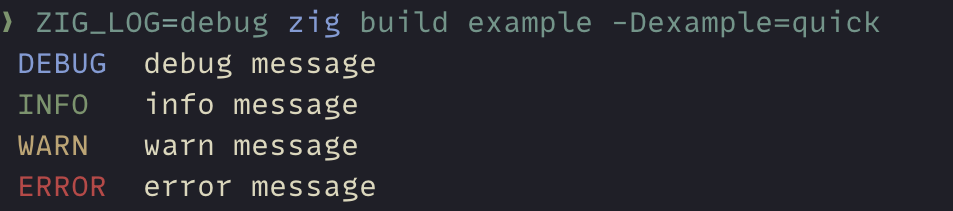
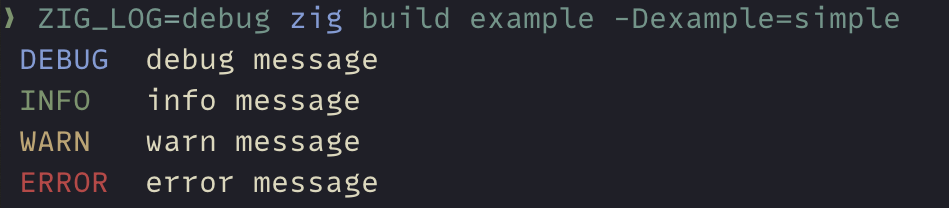
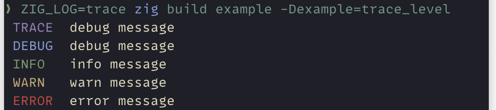
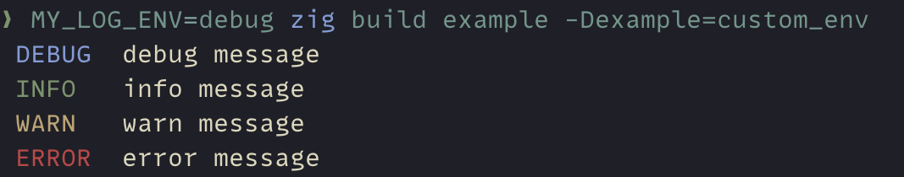
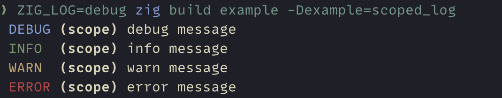
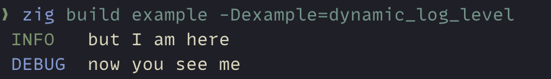
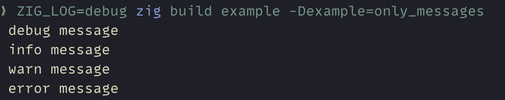
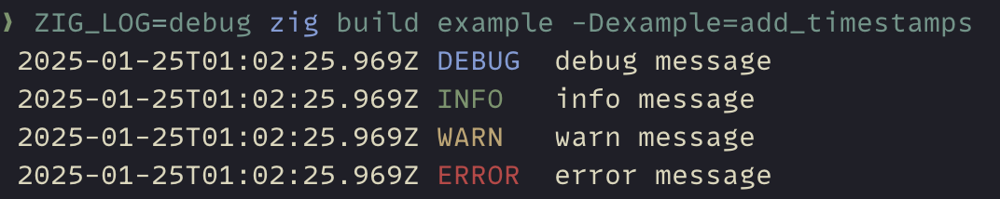
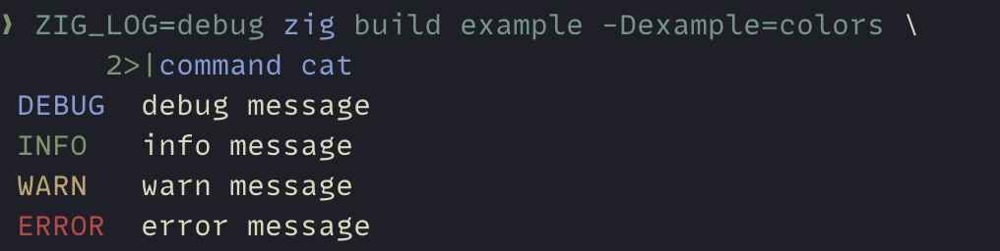

<!-- Autogenerated: Edit `README.md.tpl` and run `zig build readme` -->

# env-logger [![CI Status][ci-badge]][ci-url] ![License: MIT][license-badge]

[ci-badge]: https://github.com/knutwalker/env-logger/actions/workflows/ci.yml/badge.svg
[ci-url]: https://github.com/knutwalker/env-logger
[license-badge]: https://img.shields.io/badge/license-MIT-blue.svg?style=shield

A pretty and simple logger for Zig, inspired by [pretty_env_logger](https://github.com/seanmonstar/pretty-env-logger).

The logger works together with the `std.log` API.
It provides a `logFn` function that can be set to your `std.Options`.

## Quick start example

```zig
const std = @import("std");
const env_logger = @import("env-logger");

pub const std_options = env_logger.setup(.{});

pub fn main() !void {
    env_logger.init(.{});

    std.log.debug("debug message", .{});
    std.log.info("info message", .{});
    std.log.warn("warn message", .{});
    std.log.err("error message", .{});
}

```



## Installation

Update to latest version:

```sh
zig fetch --save git+https://github.com/knutwalker/env-logger.git
```

Add to `build.zig`:

```zig
exe.root_module.addImport("env-logger", b.dependency("env-logger", .{}).module("env-logger"));
```

> [!IMPORTANT]
> `env-logger` tracks Zig `0.14.0`

## Examples

### Simple example

Setting up the logger happens in two steps:

1. Call `env_logger.setup(.{})` and set the value as your `std.Options`.
2. Call `env_logger.init(.{})` once and as early as possible to initialize the logger.

`env-logger` will read the `ZIG_LOG` environment variable and parse it as the log level.
It logs colored messages to stderr by default.

```zig
const std = @import("std");
const env_logger = @import("env-logger");

pub const std_options = env_logger.setup(.{});

pub fn main() !void {
    env_logger.init(.{});

    if (!env_logger.defaultLevelEnabled(.debug)) {
        std.debug.print("To see all log messages, run with `env ZIG_LOG=debug ...`\n", .{});
    }

    std.log.debug("debug message", .{});
    std.log.info("info message", .{});
    std.log.warn("warn message", .{});
    std.log.err("error message", .{});
}

```



### Trace level

Zig does not define a `.trace` log level in `std.log.Level`.
`env-logger` can still log trace messages at a `.trace` level.

First enable this in the `setup` opts.
To log a trace message, prefix a debug message with `TRACE: ` (including the colon and space).

```zig
const std = @import("std");
const env_logger = @import("env-logger");

pub const std_options = env_logger.setup(.{
    .enable_trace_level = true,
});

pub fn main() !void {
    env_logger.init(.{});

    if (!env_logger.defaultLevelEnabled(.trace)) {
        std.debug.print("To see all log messages, run with `env ZIG_LOG=trace ...`\n", .{});
    }

    std.log.debug("TRACE: debug message", .{});
    std.log.debug("debug message", .{});
    std.log.info("info message", .{});
    std.log.warn("warn message", .{});
    std.log.err("error message", .{});
}

```



### Custom environment variable

By default, the logger will look for the `ZIG_LOG` environment variable in order to configure the log level.
If you want to use a different environment variable, set the name in the`filter` option.

```zig
const std = @import("std");
const env_logger = @import("env-logger");

pub const std_options = env_logger.setup(.{});

pub fn main() !void {
    env_logger.init(.{
        .filter = .{ .env_var = "MY_LOG_ENV" },
    });

    if (!env_logger.defaultLevelEnabled(.debug)) {
        std.debug.print("To see all log messages, run with `env MY_LOG_ENV=debug ...`\n", .{});
    }

    std.log.debug("debug message", .{});
    std.log.info("info message", .{});
    std.log.warn("warn message", .{});
    std.log.err("error message", .{});
}

```



### Scoped logging

Scoped loggers other than the `.default` scope will be included in the log message.

```zig
const std = @import("std");
const env_logger = @import("env-logger");

pub const std_options = env_logger.setup(.{});

pub fn main() !void {
    env_logger.init(.{});

    if (!env_logger.defaultLevelEnabled(.debug)) {
        std.debug.print("To see all log messages, run with `env ZIG_LOG=debug ...`\n", .{});
    }

    const log = std.log.scoped(.scope);

    log.debug("debug message", .{});
    log.info("info message", .{});
    log.warn("warn message", .{});
    log.err("error message", .{});
}

```



### Dynamic log level

The log level can also be set programmatically instead of using the environment variable.
It can also be changed at runtime.

```zig
const std = @import("std");
const env_logger = @import("env-logger");

pub const std_options = env_logger.setup(.{});

pub fn main() !void {
    env_logger.init(.{
        .filter = .{ .level = .info },
    });

    std.log.debug("you don't see me", .{});
    std.log.info("but I am here", .{});

    // env_logger.set_log_level(.debug);

    std.log.debug("now you see me", .{});
}

```



### Custom `std.Options`

In case you want to set other `std.Options`, you can use the `env_logger.setupWith` function.
Alternatively, you can use the `env_logger.setupFn` function and set the `logFn` field.
This allows you to statically disable certain log levels since the `setup` function sets the `log_level` field to `.debug`.

```zig
const std = @import("std");
const env_logger = @import("env-logger");

pub const std_options = env_logger.setupWith(
    .{},
    // The second argument is the std.Options that will be set.
    .{
        .fmt_max_depth = 64,
    },
);

pub fn main() !void {
    env_logger.init(.{});

    if (!env_logger.defaultLevelEnabled(.debug)) {
        std.debug.print("To see all log messages, run with `env ZIG_LOG=debug ...`\n", .{});
    }

    std.log.debug("debug message", .{});
    std.log.info("info message", .{});
    std.log.warn("warn message", .{});
    std.log.err("error message", .{});
}

```

### Only log messages

You can disable the level and logger parts of the log message and only render the message itself.

```zig
const std = @import("std");
const env_logger = @import("env-logger");

pub const std_options = env_logger.setup(.{});

pub fn main() !void {
    env_logger.init(.{
        .render_level = false,
        .render_logger = false,
    });

    if (!env_logger.defaultLevelEnabled(.debug)) {
        std.debug.print("To see all log messages, run with `env ZIG_LOG=debug ...`\n", .{});
    }

    const log = std.log.scoped(.scope);

    log.debug("debug message", .{});
    log.info("info message", .{});
    log.warn("warn message", .{});
    log.err("error message", .{});
}

```



### Add timestamps

You can also add timestamps to the log messages.

```zig
const std = @import("std");
const env_logger = @import("env-logger");

pub const std_options = env_logger.setup(.{});

pub fn main() !void {
    env_logger.init(.{
        .render_timestamp = true,
    });

    if (!env_logger.defaultLevelEnabled(.debug)) {
        std.debug.print("To see all log messages, run with `env ZIG_LOG=debug ...`\n", .{});
    }

    std.log.debug("debug message", .{});
    std.log.info("info message", .{});
    std.log.warn("warn message", .{});
    std.log.err("error message", .{});
}

```



### Log to different outputs

By default, the logger logs to stderr, but it can also be configured to log to stdout, append to a file, or write to a writer.

```zig
const std = @import("std");
const env_logger = @import("env-logger");

pub const std_options = env_logger.setup(.{});

pub fn main() !void {
    var gpa = std.heap.GeneralPurposeAllocator(.{}){};
    defer _ = gpa.deinit();
    const allocator = gpa.allocator();

    var args = try std.process.argsWithAllocator(allocator);
    defer args.deinit();

    _ = args.next() orelse return; // skip the executable name

    const output_filename = args.next() orelse {
        std.debug.print("Usage: log_to_file $FILENAME\n", .{});
        std.process.exit(1);
    };

    var output: env_logger.InitOptions.Output = .stderr;
    var buf: ?std.ArrayList(u8) = null;
    defer if (buf) |b| b.deinit();

    if (std.mem.eql(u8, output_filename, "-")) {
        output = .stdout;
    } else if (std.mem.eql(u8, output_filename, "+")) {
        buf = .init(allocator);
        output = .{ .writer = buf.?.writer().any() };
    } else {
        const output_file = try std.fs.cwd().createFile(
            output_filename,
            // Set `truncate` to false to append to the file.
            .{ .truncate = false },
        );
        output = .{ .file = output_file };
    }

    env_logger.init(.{ .output = output });

    if (!env_logger.defaultLevelEnabled(.debug)) {
        std.debug.print("To see all log messages, run with `env ZIG_LOG=debug ...`\n", .{});
    }

    std.log.debug("debug message", .{});
    std.log.info("info message", .{});
    std.log.warn("warn message", .{});
    std.log.err("error message", .{});

    if (buf) |b| {
        std.debug.print("Contents of buffer:\n{s}\n", .{b.items});
    }
}

```

### Configure colors

By default, the logger will detect if the terminal supports colors and use them.
You can disable this by setting the `enable_color` option to `false`.
Alternatively, you can force the logger to use colors by setting the `force_color` option to `true`.

```zig
const std = @import("std");
const env_logger = @import("env-logger");

pub const std_options = env_logger.setup(.{});

pub fn main() !void {
    env_logger.init(.{
        // disable all use of colors,
        .enable_color = false,
        // force the use of colors, also for files and writers
        .force_color = true,
    });

    if (!env_logger.defaultLevelEnabled(.debug)) {
        std.debug.print("To see all log messages, run with `env ZIG_LOG=debug ...`\n", .{});
    }

    // try piping stderr to a file, it's still colored
    std.log.debug("debug message", .{});
    std.log.info("info message", .{});
    std.log.warn("warn message", .{});
    std.log.err("error message", .{});
}

```



## Contributing

Contributions are welcome!

Please open an issue or a pull request if you have any suggestions or improvements.


## License

env-logger is licensed under the [MIT License](http://opensource.org/licenses/MIT)

---

<!-- vim: set ft=markdown: -->
