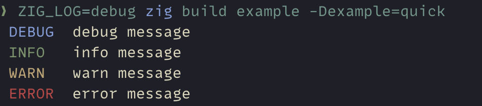
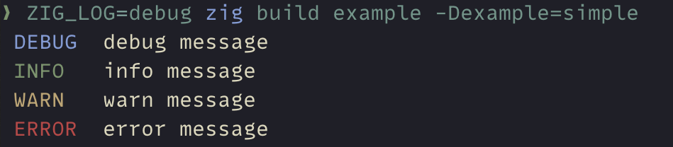
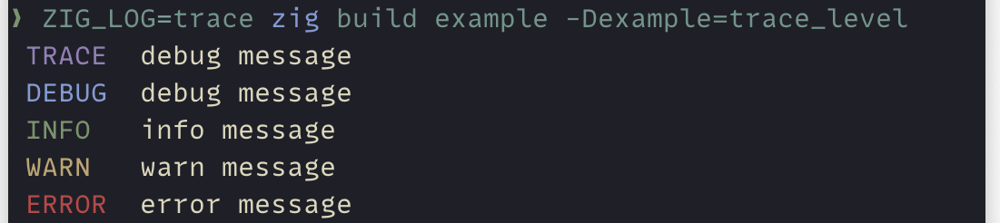
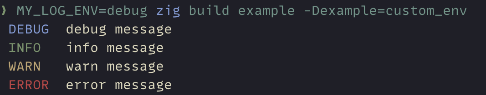
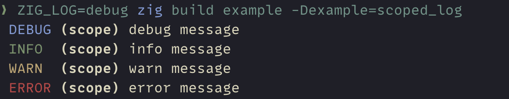
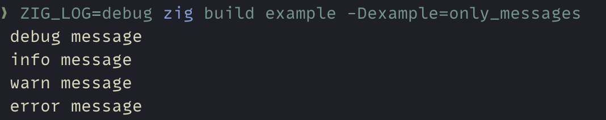
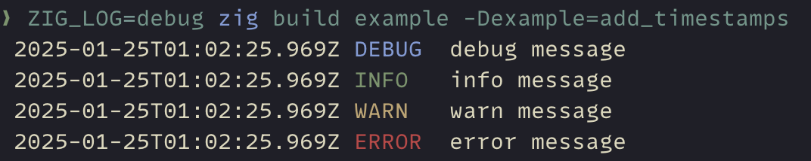
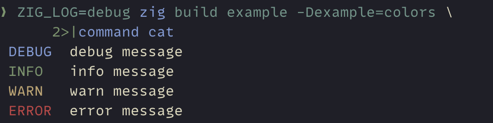

<!-- Autogenerated: Edit `README.md.tpl` and run `zig build readme` -->

# env-logger [![CI Status][ci-badge]][ci-url] ![License: MIT][license-badge]

[ci-badge]: https://github.com/knutwalker/env-logger/actions/workflows/ci.yml/badge.svg
[ci-url]: https://github.com/knutwalker/env-logger
[license-badge]: https://img.shields.io/badge/license-MIT-blue.svg?style=shield

A pretty logger for Zig, inspired by [pretty_env_logger](https://github.com/seanmonstar/pretty-env-logger).

The logger works together with the `std.log` API.
It provides a `logFn` function that can be set to your `std.Options`.

## Quick start example

```zig

const std = @import("std");

const env_logger = @import("env_logger");

pub const std_options = env_logger.setup(.{});

pub fn main(init: std.process.Init) !void {
    env_logger.init(init, .{});

    std.log.debug("debug message", .{});
    std.log.info("info message", .{});
    std.log.warn("warn message", .{});
    std.log.err("error message", .{});
}

```



## Installation

Update to latest version:

```sh
zig fetch --save git+https://github.com/knutwalker/env-logger.git
```

Add to `build.zig`:

```zig
exe.root_module.addImport("env-logger", b.dependency("env-logger", .{}).module("env-logger"));
```

> [!IMPORTANT]
> `env-logger` tracks Zig `0.16.0`

## Examples

### Starting example

Setting up the logger happens in two steps:

1. Call `env_logger.setup(.{})` and set the value as your `std.Options`.
2. Call `env_logger.init(init, .{})` once and as early as possible to initialize the logger.
   The first argument is the `std.process.Init` instance and provides the `Io` instance, environment, and allocators.

`env-logger` will read the `ZIG_LOG` environment variable and parse it as the log level.
It logs colored messages to stderr by default.

```zig

const std = @import("std");

const env_logger = @import("env_logger");

pub const std_options = env_logger.setup(.{});

pub fn main(init: std.process.Init) !void {
    env_logger.init(init, .{});

    if (!env_logger.defaultLevelEnabled(.debug)) {
        std.debug.print("To see all log messages, run with `env ZIG_LOG=debug ...`\n", .{});
    }

    std.log.debug("debug message", .{});
    std.log.info("info message", .{});
    std.log.warn("warn message", .{});
    std.log.err("error message", .{});
}

```



### Trace level

Zig does not define a `.trace` log level in `std.log.Level`.
`env-logger` can still log trace messages at a `.trace` level.

First enable this in the `setup` opts.
To log a trace message, prefix a debug message with `TRACE: ` (including the colon and space).

```zig

const std = @import("std");

const env_logger = @import("env_logger");

pub const std_options = env_logger.setup(.{
    .enable_trace_level = true,
});

pub fn main(init: std.process.Init) !void {
    env_logger.init(init, .{});

    if (!env_logger.defaultLevelEnabled(.trace)) {
        std.debug.print("To see all log messages, run with `env ZIG_LOG=trace ...`\n", .{});
    }

    std.log.debug("TRACE: debug message", .{});
    std.log.debug("debug message", .{});
    std.log.info("info message", .{});
    std.log.warn("warn message", .{});
    std.log.err("error message", .{});
}

```



### Custom environment variable

By default, the logger will look for the `ZIG_LOG` environment variable in order to configure the log level.
If you want to use a different environment variable, set the name in the`filter` option.

```zig

const std = @import("std");

const env_logger = @import("env_logger");

pub const std_options = env_logger.setup(.{});

pub fn main(init: std.process.Init) !void {
    env_logger.init(init, .{
        .filter = .{ .env = .{ .name = "MY_LOG_ENV" } },
    });

    if (!env_logger.defaultLevelEnabled(.debug)) {
        std.debug.print("To see all log messages, run with `env MY_LOG_ENV=debug ...`\n", .{});
    }

    std.log.debug("debug message", .{});
    std.log.info("info message", .{});
    std.log.warn("warn message", .{});
    std.log.err("error message", .{});
}

```



### Scoped logging

Scoped loggers other than the `.default` scope will be included in the log message.

```zig

const std = @import("std");

const env_logger = @import("env_logger");

pub const std_options = env_logger.setup(.{});

pub fn main(init: std.process.Init) !void {
    env_logger.init(init, .{});

    if (!env_logger.defaultLevelEnabled(.debug)) {
        std.debug.print("To see all log messages, run with `env ZIG_LOG=debug ...`\n", .{});
    }

    const log = std.log.scoped(.scope);

    log.debug("debug message", .{});
    log.info("info message", .{});
    log.warn("warn message", .{});
    log.err("error message", .{});
}

```



### Static log level

`env-logger` sets the `log_level` in `std.Options` to `.debug` in order to apply to actual level at runtime.
You can set the `min_log_level` in `setup` to override this and full disable certain levels.

```zig

const std = @import("std");

const env_logger = @import("env_logger");

// Setting a log_level here will always discard any message of a lower level
// even if the filter would allow them. Higher levels can still be filtered.
pub const std_options = env_logger.setup(.{ .min_log_level = .info });

pub fn main(init: std.process.Init) !void {
    // can also set the runtime level directly without parsing
    env_logger.init(init, .{ .filter = .{ .level = .debug } });

    // std.log.logEnabled returns false for debug, which will effectively
    // remove all calls to log.debug at comptime
    try std.testing.expect(std.log.logEnabled(.debug, .default) == false);

    // env_logger still reports that debug is enabled according to the filter logic
    try std.testing.expect(env_logger.levelEnabled(.default, .debug) == true);

    // struct does not have a format function, but debug calls are eliminated
    // so this is never reported by the compiler and compilation succeeds
    std.log.debug("you will never see me: {f}", .{struct {}});
    std.log.info("info message", .{});
    std.log.warn("warn message", .{});
    std.log.err("error message", .{});
}

```

<!-- TODO: -->

### Custom `std.Options`

In case you want to set other `std.Options`, you can use the `env_logger.setupWith` function.
Alternatively, you can use the `env_logger.loggerFn` function and set the `logFn` field.

```zig

const std = @import("std");

const env_logger = @import("env_logger");

pub const std_options = env_logger.setupWith(
    .{},
    // The second argument is the std.Options that will be set.
    .{
        .fmt_max_depth = 64,
    },
);

pub fn main(init: std.process.Init) !void {
    env_logger.init(init, .{});

    if (!env_logger.defaultLevelEnabled(.debug)) {
        std.debug.print("To see all log messages, run with `env ZIG_LOG=debug ...`\n", .{});
    }

    std.log.debug("debug message", .{});
    std.log.info("info message", .{});
    std.log.warn("warn message", .{});
    std.log.err("error message", .{});
}

```

### Only log messages

You can disable the level and logger parts of the log message and only render the message itself.

```zig

const std = @import("std");

const env_logger = @import("env_logger");

pub const std_options = env_logger.setup(.{});

pub fn main(init: std.process.Init) !void {
    env_logger.init(init, .{
        .render_level = false,
        .render_logger = false,
    });

    if (!env_logger.defaultLevelEnabled(.debug)) {
        std.debug.print("To see all log messages, run with `env ZIG_LOG=debug ...`\n", .{});
    }

    const log = std.log.scoped(.scope);

    log.debug("debug message", .{});
    log.info("info message", .{});
    log.warn("warn message", .{});
    log.err("error message", .{});
}

```



### Add timestamps

You can also add timestamps to the log messages.

```zig

const std = @import("std");

const env_logger = @import("env_logger");

pub const std_options = env_logger.setup(.{});

pub fn main(init: std.process.Init) !void {
    env_logger.init(init, .{
        .render_timestamp = true,
    });

    if (!env_logger.defaultLevelEnabled(.debug)) {
        std.debug.print("To see all log messages, run with `env ZIG_LOG=debug ...`\n", .{});
    }

    std.log.debug("debug message", .{});
    std.log.info("info message", .{});
    std.log.warn("warn message", .{});
    std.log.err("error message", .{});
}

```



### Log to different outputs

By default, the logger logs to stderr, but it can also be configured to log to stdout, append to a file, or write to a writer.

```zig

const std = @import("std");

const env_logger = @import("env_logger");

pub const std_options = env_logger.setup(.{});

pub fn main(init: std.process.Init) !void {
    var args = try init.minimal.args.iterateAllocator(init.gpa);
    defer args.deinit();

    _ = args.next() orelse return; // skip the executable name

    var output: env_logger.InitOptions.Output = .stderr;
    var buf: ?std.Io.Writer.Allocating = null;
    defer if (buf) |*b| b.deinit();

    if (args.next()) |output_filename| {
        if (std.mem.eql(u8, output_filename, "-")) {
            output = .stdout;
        } else if (std.mem.eql(u8, output_filename, "+")) {
            buf = .init(init.gpa);
            output = .{ .writer = &buf.?.writer };
        } else {
            const output_file = try std.Io.Dir.cwd().createFile(
                init.io,
                output_filename,
                // To append to the log, set `truncate` to false and `read` to true.
                // Alternatively, use `file_start` to always write from the start
                //  and not require read permissions.
                .{ .read = true, .truncate = false },
            );
            output = .{ .file = output_file };
        }
    }

    env_logger.init(init, .{ .output = output });
    // deinit will close any eventual file handles
    defer env_logger.deinit();

    if (!env_logger.defaultLevelEnabled(.debug)) {
        std.debug.print("To see all log messages, run with `env ZIG_LOG=debug ...`\n", .{});
    }

    std.log.debug("debug message", .{});
    std.log.info("info message", .{});
    std.log.warn("warn message", .{});
    std.log.err("error message", .{});

    if (buf) |*b| {
        std.debug.print("Contents of buffer:\n{s}\n", .{b.written()});
    }
}

```

### Configure colors

By default, the logger will detect if the terminal supports colors and use them.
You can disable this by setting the `enable_color` option to `false`.
Alternatively, you can force the logger to use colors by setting the `force_color` option to `true`.

```zig

const std = @import("std");

const env_logger = @import("env_logger");

pub const std_options = env_logger.setup(.{});

pub fn main(init: std.process.Init) !void {
    env_logger.init(init, .{
        // disable all use of colors,
        .enable_color = false,
        // force the use of colors, also for files and writers
        .force_color = true,
    });

    if (!env_logger.defaultLevelEnabled(.debug)) {
        std.debug.print("To see all log messages, run with `env ZIG_LOG=debug ...`\n", .{});
    }

    // try piping stderr to a file, it's still colored
    std.log.debug("debug message", .{});
    std.log.info("info message", .{});
    std.log.warn("warn message", .{});
    std.log.err("error message", .{});
}

```



### Configure allocators

Parsing and constructing the log filter requires allocations.
The default pattern is to pass the `std.process.Init` instance to `init`.
This uses the allocators setup by the juicy main function.
Skipping this via `initRaw` uses a `std.heap.page_allocator` and leaks memory.
If you want to use a different allocator, you can set the `allocator` option in `init`.
You can also drop down to `initMin` and pass `std.process.Init.Minimal`.

Since the filter is supposed to be kept for the remainder
of the program's lifetime, you can set two different allocators, one
for all the parsing (e.g. a gpa, like the `DebugAllocator`), and another
one for the final filter allocation (e.g. an arena allocator).

```zig

const std = @import("std");

const env_logger = @import("env_logger");

pub const std_options = env_logger.setup(.{});

pub fn main(init: std.process.Init.Minimal) !void {
    var gpa: std.heap.DebugAllocator(.{ .verbose_log = true }) = .init;
    defer if (gpa.deinit() == .leak) @panic("memory leak");

    var arena = std.heap.ArenaAllocator.init(std.heap.page_allocator);
    defer arena.deinit();

    env_logger.initMin(init, .{ .allocator = .{ .split = .{
        .parse_gpa = gpa.allocator(),
        .filter_arena = arena.allocator(),
    } } });

    if (!env_logger.defaultLevelEnabled(.debug)) {
        std.debug.print("To see all log messages, run with `env ZIG_LOG=debug ...`\n", .{});
    }

    std.log.debug("debug message", .{});
    std.log.info("info message", .{});
    std.log.warn("warn message", .{});
    std.log.err("error message", .{});
}

```


## Contributing

Contributions are welcome!

Please open an issue or a pull request if you have any suggestions or improvements.

## License

env-logger is licensed under the [MIT License](http://opensource.org/licenses/MIT)

---

<!-- vim: set ft=markdown: -->
